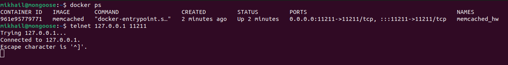
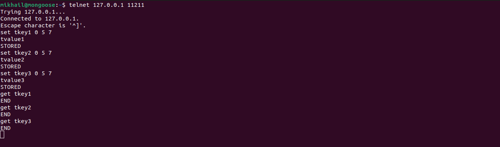
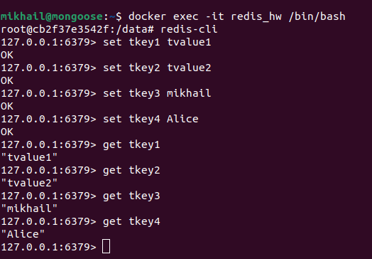

# Домашнее задание к занятию "`Кеширование Redis/memcached`" - `Байков Михаил`

### Задание 1 Кеширование 
Приведите примеры проблем, которые может решить кеширование. 

*Приведите ответ в свободной форме.*

### Решение 1
Кеширование может помочь ускорению вывода часто используемых данных. Например ответы на тяжелые SQL запросы.

### Задание 2 Memcached
Установите и запустите memcached.

*Приведите скриншот systemctl status memcached, где будет видно, что memcached запущен.*

### Решение 2
Надеюсь это не будет считаться отступлением, но я использовал для запуска memcached docker. Так быстрее и удобнее) Если это критичный вопрос могу переделать.

### Задание 3 Удаление по TTL в Memcached
Запишите в memcached несколько ключей с любыми именами и значениями, для которых выставлен TTL 5. 

*Приведите скриншот, на котором видно, что спустя 5 секунд ключи удалились из базы.*

### Решение 3

### Задание 4 Запись данных в Redis
Запишите в Redis несколько ключей с любыми именами и значениями. 

*Через redis-cli достаньте все записанные ключи и значения из базы, приведите скриншот этой операции.*

### Решение 4

